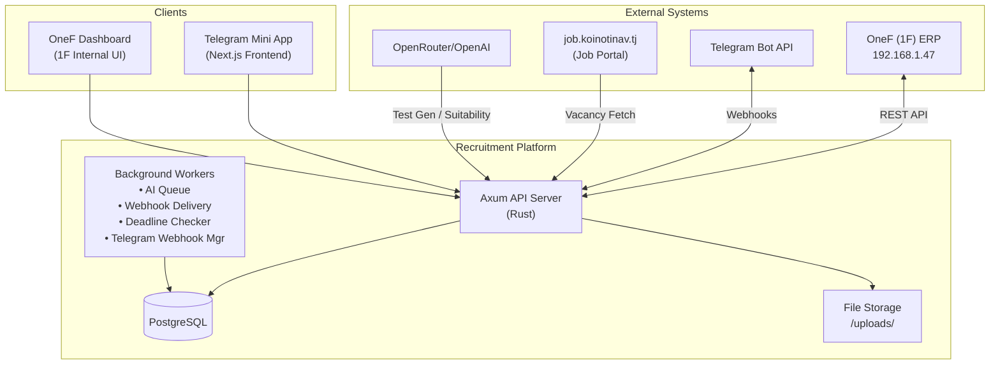
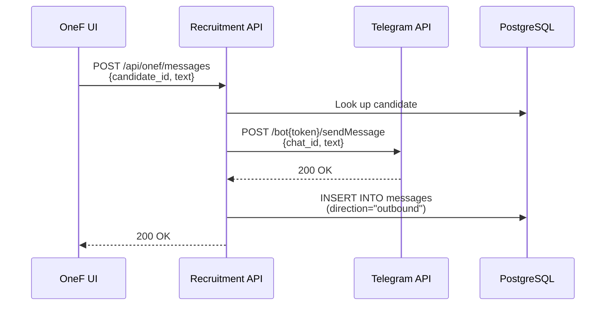
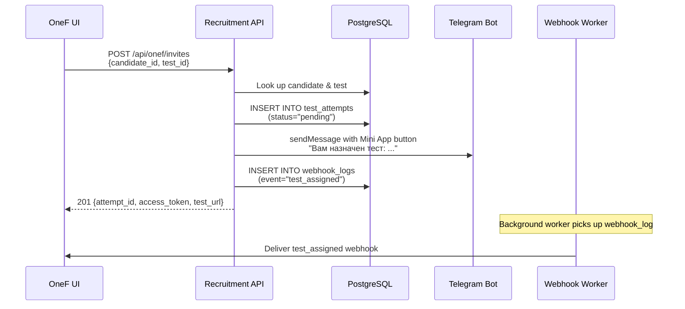
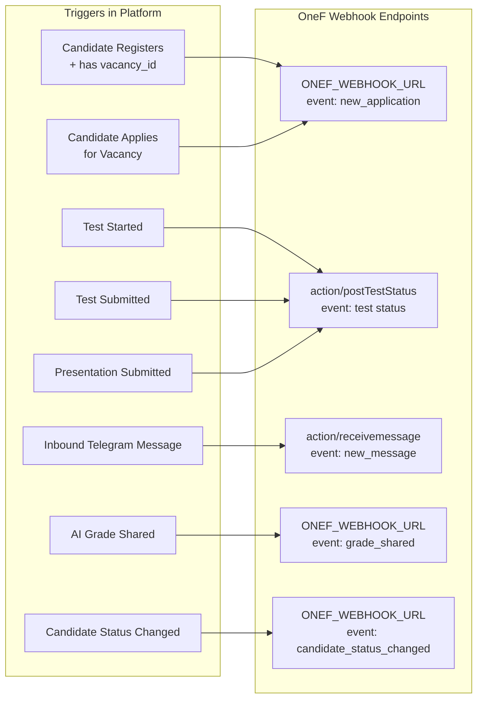
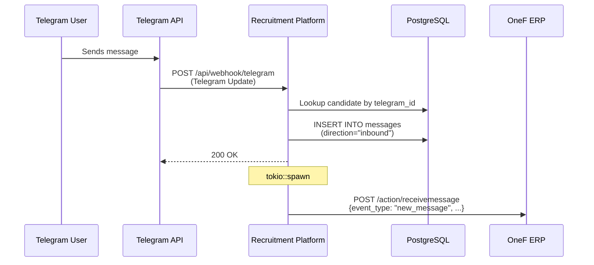
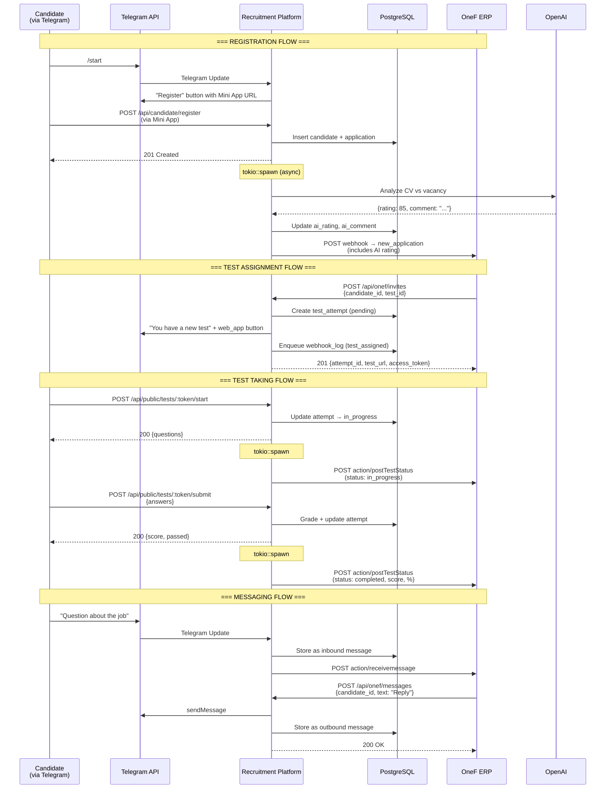

# 🔬 Full Project & OneF Integration Analysis

> **Project:** Rust-Screenx-HR-Automatization (Recruitment Platform)  
> **Stack:** Rust (Axum) + PostgreSQL + Telegram Bot + Next.js Frontend  
> **Analyzed:** 2026-03-12

---

## 1. Project Overview

This is a **recruitment management platform** that bridges the **"Первая Форма" (OneF / 1F) HR/ERP system**, a **Telegram Bot**, and a **Telegram Mini App**. It automates the candidate lifecycle from registration through testing to hiring.

### Architecture Diagram



### Technology Stack

| Layer | Technology |
|-------|-----------|
| **Backend** | Rust, Axum, SQLx, Tokio |
| **Database** | PostgreSQL 15+ |
| **Frontend** | Next.js (Telegram Mini App) |
| **AI** | OpenRouter / OpenAI API |
| **Messaging** | Telegram Bot API |
| **Job Portal** | job.koinotinav.tj (Selenium automation) |
| **Container** | Docker + docker-compose |

### Key Business Domains

1. **Candidate Management** — Registration, profile updates, CV uploads, AI suitability analysis
2. **Vacancy Management** — Internal vacancies + external (Koinoti Nav) + Selenium-based vacancy creation
3. **Test/Assessment Management** — AI-generated tests, question-based tests, presentations, grading
4. **Messaging** — Bidirectional Telegram chat (inbound/outbound), stored in DB
5. **OneF Integration** — Bidirectional data sync with the 1F ERP system

---

## 2. API Surface Overview

The API is organized into **4 major route groups** plus base routes:

| Group | Prefix | Auth | Rate Limit | Purpose |
|-------|--------|------|-----------|---------|
| **Base** | `/health` | None | None | Readiness probe |
| **Integration** | `/api/integration/*` | JWT (planned) | 10 RPS | Admin dashboard API, test management |
| **Public** | `/api/public/*`, `/api/candidate/*` | Token-based / None | 20 RPS | Candidate-facing flows, Telegram webhook |
| **OneF** | `/api/onef/*` | None (planned) | 10 RPS | **Dedicated OneF ERP endpoints** |
| **Webhook** | `/webhook/*` | `X-Webhook-Secret` header | None | Signed event ingestion |

### Background Workers (spawned at startup)

| Worker | Interval | Purpose |
|--------|----------|---------|
| **Telegram Webhook Manager** | Every 30 minutes | Ensures Telegram webhook URL stays in sync |
| **AI Queue Worker** | 750ms polling | Processes `ai_jobs` table entries for AI test generation |
| **Notification Worker** | 1s polling | Delivers pending webhook_logs with exponential backoff retry |
| **Deadline Checker** | Every 60s | Checks test attempt deadlines and sends notifications |

---

## 3. OneF (1F) Endpoints — What OneF Calls on Our Platform

These are all under `/api/onef/*` and are designed specifically for the OneF ERP's frontend/backend to consume.

### 3.1 Dashboard

| Method | Path | Handler | Description |
|--------|------|---------|-------------|
| `GET` | `/api/onef/dashboard` | [get_dashboard_stats](file:///home/qwantum/Documents/projects/Rust-Screenx-HR-Automatization/recruitment-backend/src/routes/onef.rs#L156-L194) | Aggregated recruitment metrics |

**Response Shape:**
```json
{
  "candidates_total": 42,
  "candidates_new_today": 3,
  "active_vacancies": 15,
  "test_attempts_pending": 7,
  "recruitment_funnel": {
    "registered": 42,
    "applied": 42,
    "test_started": 20,
    "test_completed": 15,
    "hired": 5
  }
}
```

**Data Sources:**
- [candidates](file:///home/qwantum/Documents/projects/Rust-Screenx-HR-Automatization/recruitment-backend/src/routes/onef.rs#266-286) table (status counts, history counts)
- [vacancies](file:///home/qwantum/Documents/projects/Rust-Screenx-HR-Automatization/recruitment-backend/src/routes/onef.rs#331-366) table (internal published)
- External job portal API (koinotinav)
- [test_attempts](file:///home/qwantum/Documents/projects/Rust-Screenx-HR-Automatization/recruitment-backend/src/routes/integration.rs#334-354) table (status distribution)

---

### 3.2 Candidate Management

| Method | Path | Handler | Description |
|--------|------|---------|-------------|
| `GET` | `/api/onef/candidates` | [list_candidates](file:///home/qwantum/Documents/projects/Rust-Screenx-HR-Automatization/recruitment-backend/src/routes/onef.rs#L266-L285) | All candidates with OneF-shaped response |
| `GET` | `/api/onef/candidates/:id` | [get_candidate](file:///home/qwantum/Documents/projects/Rust-Screenx-HR-Automatization/recruitment-backend/src/routes/onef.rs#L211-L232) | Single candidate details |
| `POST` | `/api/onef/candidates/:id/status` | [update_candidate_status](file:///home/qwantum/Documents/projects/Rust-Screenx-HR-Automatization/recruitment-backend/src/routes/onef.rs#L196-L209) | Change candidate status |
| `POST` | `/api/onef/candidates/:id/analyze` | [analyze_candidate_suitability](file:///home/qwantum/Documents/projects/Rust-Screenx-HR-Automatization/recruitment-backend/src/routes/candidate_routes.rs#L475-L533) | Trigger AI suitability analysis |

**[OneFCandidateResponse](file:///home/qwantum/Documents/projects/Rust-Screenx-HR-Automatization/recruitment-backend/src/routes/onef.rs#74-86) shape:**
```json
{
  "id": "uuid",
  "telegram_id": 1320166360,
  "name": "John Doe",
  "email": "john@example.com",
  "phone": "+992901234567",
  "cv_url": "uploads/cv/abc123.pdf",
  "status": "new",
  "ai_rating": 85,
  "ai_comment": "Strong candidate...",
  "created_at": "2026-01-08T10:30:00Z"
}
```

**Available Statuses (dictionary):**
[new](file:///home/qwantum/Documents/projects/Rust-Screenx-HR-Automatization/recruitment-backend/src/lib.rs#39-74) → `reviewing` → [test_assigned](file:///home/qwantum/Documents/projects/Rust-Screenx-HR-Automatization/recruitment-backend/src/routes/webhook.rs#36-67) → [test_completed](file:///home/qwantum/Documents/projects/Rust-Screenx-HR-Automatization/recruitment-backend/src/routes/webhook.rs#68-99) → `interview` → `accepted` / `rejected`

---

### 3.3 Messaging (Telegram Bridge)

| Method | Path | Handler | Description |
|--------|------|---------|-------------|
| `POST` | `/api/onef/messages` | [send_message](file:///home/qwantum/Documents/projects/Rust-Screenx-HR-Automatization/recruitment-backend/src/routes/onef.rs#L87-L128) | Send message to candidate via Telegram |
| `GET` | `/api/onef/messages/:candidate_id` | [get_chat_history](file:///home/qwantum/Documents/projects/Rust-Screenx-HR-Automatization/recruitment-backend/src/routes/onef.rs#L130-L147) | Get chat history (auto-marks inbound as read) |
| `GET` | `/api/onef/messages/unread` | [get_unread_count](file:///home/qwantum/Documents/projects/Rust-Screenx-HR-Automatization/recruitment-backend/src/routes/onef.rs#L149-L154) | Global unread inbound messages count |

**Send Message Flow:**


---

### 3.4 Test & Attempt Management

| Method | Path | Handler | Description |
|--------|------|---------|-------------|
| `GET` | `/api/onef/tests` | [list_tests](file:///home/qwantum/Documents/projects/Rust-Screenx-HR-Automatization/recruitment-backend/src/routes/onef.rs#L395-L426) | List active tests |
| `POST` | `/api/onef/invites` | [create_test_invite](file:///home/qwantum/Documents/projects/Rust-Screenx-HR-Automatization/recruitment-backend/src/routes/onef.rs#L458-L562) | Create test invite + send Telegram notification |
| `GET` | `/api/onef/candidates/:id/attempts` | [get_candidate_attempts](file:///home/qwantum/Documents/projects/Rust-Screenx-HR-Automatization/recruitment-backend/src/routes/onef.rs#L234-L248) | All test attempts for a candidate |
| `GET` | `/api/onef/attempts` | [list_all_attempts](file:///home/qwantum/Documents/projects/Rust-Screenx-HR-Automatization/recruitment-backend/src/routes/onef.rs#L307-L314) | Unpaginated list of all attempts |
| `GET` | `/api/onef/attempts_filter` | [list_attempts_filter](file:///home/qwantum/Documents/projects/Rust-Screenx-HR-Automatization/recruitment-backend/src/routes/onef.rs#L287-L305) | Paginated + filterable attempts |
| `GET` | `/api/onef/attempts/:id` | [get_test_attempt](file:///home/qwantum/Documents/projects/Rust-Screenx-HR-Automatization/recruitment-backend/src/routes/onef.rs#L250-L264) | Detailed attempt with test info |

**Test Invite Flow (from OneF):**


---

### 3.5 Vacancy Management

| Method | Path | Handler | Description |
|--------|------|---------|-------------|
| `GET` | `/api/onef/vacancies` | [list_vacancies](file:///home/qwantum/Documents/projects/Rust-Screenx-HR-Automatization/recruitment-backend/src/routes/onef.rs#L331-L365) | Combined internal + external vacancies |
| `GET` | `/api/onef/vacancies/:id` | [get_vacancy](file:///home/qwantum/Documents/projects/Rust-Screenx-HR-Automatization/recruitment-backend/src/routes/onef.rs#L367-L393) | Single vacancy (UUID or numeric ID) |
| `POST` | `/api/onef/vacancies/external` | [create_external_vacancy](file:///home/qwantum/Documents/projects/Rust-Screenx-HR-Automatization/recruitment-backend/src/routes/external_vacancy.rs#L14-L28) | Create vacancy on job.koinotinav.tj via Selenium |
| `POST` | `/api/onef/vacancies/external/delete` | [delete_external_vacancy](file:///home/qwantum/Documents/projects/Rust-Screenx-HR-Automatization/recruitment-backend/src/routes/external_vacancy.rs#L30-L44) | Delete external vacancy via Selenium |
| `POST` | `/api/onef/vacancies/description` | [generate_vacancy_description](file:///home/qwantum/Documents/projects/Rust-Screenx-HR-Automatization/recruitment-backend/src/routes/integration.rs#L444-L455) | AI-generate vacancy description |

---

### 3.6 Dictionary Endpoints

| Method | Path | Handler | Description |
|--------|------|---------|-------------|
| `GET` | `/api/onef/dictionaries/candidate-statuses` | [list_candidate_statuses](file:///home/qwantum/Documents/projects/Rust-Screenx-HR-Automatization/recruitment-backend/src/routes/onef.rs#L429-L441) | Dropdown values for candidate statuses |
| `GET` | `/api/onef/dictionaries/test-statuses` | [list_test_statuses](file:///home/qwantum/Documents/projects/Rust-Screenx-HR-Automatization/recruitment-backend/src/routes/onef.rs#L443-L456) | Dropdown values for test attempt statuses |

---

## 4. Webhooks — What Our Platform Pushes TO OneF

The [OneFService](file:///home/qwantum/Documents/projects/Rust-Screenx-HR-Automatization/recruitment-backend/src/services/onef_service.rs#88-92) ([onef_service.rs](file:///home/qwantum/Documents/projects/Rust-Screenx-HR-Automatization/recruitment-backend/src/services/onef_service.rs)) is the core outbound communication layer. It sends fire-and-forget HTTP POST requests to OneF.

### 4.1 Configuration

```bash
# Configurable webhook target (used for new_application, grade_shared, candidate_status_changed)
ONEF_WEBHOOK_URL=http://192.168.1.47/app/v1.2/api/publications/...

# Hard-coded endpoints for test status and messages
# - Test status:  http://192.168.1.47/app/v1.2/api/publications/action/postTestStatus
# - Messages:     http://192.168.1.47/app/v1.2/api/publications/action/receivemessage
```

> [!WARNING]
> Two endpoints ([notify_test_status](file:///home/qwantum/Documents/projects/Rust-Screenx-HR-Automatization/recruitment-backend/src/services/onef_service.rs#291-319), [notify_new_message](file:///home/qwantum/Documents/projects/Rust-Screenx-HR-Automatization/recruitment-backend/src/services/onef_service.rs#256-290)) have **hard-coded IP addresses** (`192.168.1.47`) instead of using the configurable `ONEF_WEBHOOK_URL`. This means they will not work if OneF's IP changes.

### 4.2 All Webhook Event Types



---

### 4.3 Webhook #1: `new_application`

**Triggered by:** Candidate registration (`POST /api/candidate/register`) or application (`POST /api/candidate/apply`)

**Target:** `ONEF_WEBHOOK_URL` (configurable)

**Called from:**
- [candidate_routes.rs:303](file:///home/qwantum/Documents/projects/Rust-Screenx-HR-Automatization/recruitment-backend/src/routes/candidate_routes.rs#L303-L315) — Registration flow
- [candidate_routes.rs:441](file:///home/qwantum/Documents/projects/Rust-Screenx-HR-Automatization/recruitment-backend/src/routes/candidate_routes.rs#L441-L453) — Apply flow

**Execution:** Asynchronous (`tokio::spawn`) — does NOT block the HTTP response

**Payload (wrapped in `{ requestBody: ... }`):**
```json
{
  "requestBody": {
    "event_type": "new_application",
    "vacancy_id": 148,
    "vacancy_name": "Senior Software Developer",
    "candidate": {
      "id": "uuid",
      "telegram_id": 1320166360,
      "fullname": "John Doe",
      "name": "John",
      "surname": "Doe",
      "email": "john@example.com",
      "phone": "+992901234567",
      "dob": "1995-06-15",
      "cv_url": "https://webapp-url/uploads/cv/abc.pdf",
      "ai_rating": 85,
      "ai_comment": "Strong match..."
    },
    "applied_at": "2026-01-08T12:00:00+00:00"
  }
}
```

> [!IMPORTANT]
> The registration flow runs **AI suitability analysis first** (if CV and vacancy description are available), then includes the `ai_rating` and `ai_comment` in the OneF webhook payload.

---

### 4.4 Webhook #2: `postTestStatus` (Test Status Updates)

**Triggered by:** Test lifecycle events in the public API

**Target:** Hard-coded `http://192.168.1.47/app/v1.2/api/publications/action/postTestStatus`

**Called from:**
- [public.rs:120](file:///home/qwantum/Documents/projects/Rust-Screenx-HR-Automatization/recruitment-backend/src/routes/public.rs#L120-L134) — Test **started** (`status = "in_progress"`)
- [public.rs:332](file:///home/qwantum/Documents/projects/Rust-Screenx-HR-Automatization/recruitment-backend/src/routes/public.rs#L332-L346) — Presentation **submitted** (`status = "completed"`)
- [public.rs:509](file:///home/qwantum/Documents/projects/Rust-Screenx-HR-Automatization/recruitment-backend/src/routes/public.rs#L509-L523) — Test **completed** with score (`status = "completed"`)

**Execution:** Asynchronous (`tokio::spawn`) with candidate lookup by email

**Vacancy ID Resolution Logic:**
```
1. Check attempt.metadata["vacancy_id"]
2. Fallback: candidate's first application vacancy_id
3. Fallback: candidate.vacancy_id
```

**Payload (wrapped in `{ requestBody: ... }`):**
```json
{
  "requestBody": {
    "candidate_id": "uuid",
    "test_id": "uuid",
    "vacancy_id": 148,
    "test_status": "completed",
    "event_date": "2026-01-08T12:30:00+00:00",
    "event_data": {
      "attempt_id": "uuid",
      "user_score": 85.0,
      "max_score": 100.0,
      "percentage": 85.0,
      "passed": true,
      "result_url": "https://webapp-url/uploads/results/uuid.txt"
    }
  }
}
```

**Variations by event:**

| Event | [test_status](file:///home/qwantum/Documents/projects/Rust-Screenx-HR-Automatization/recruitment-backend/src/routes/onef.rs#443-457) | `event_data` includes |
|-------|-------------|----------------------|
| Test started | `"in_progress"` | Only `attempt_id` (scores are null) |
| Presentation submitted | `"completed"` | `attempt_id`, `result_url` (link + file path) |
| Test graded | `"completed"` | Full: `user_score`, `max_score`, `percentage`, `passed`, `result_url` |

---

### 4.5 Webhook #3: `receivemessage` (Inbound Messages)

**Triggered by:** Candidate sends a message via Telegram

**Target:** Hard-coded `http://192.168.1.47/app/v1.2/api/publications/action/receivemessage`

**Called from:** [telegram.rs:55-62](file:///home/qwantum/Documents/projects/Rust-Screenx-HR-Automatization/recruitment-backend/src/routes/telegram.rs#L55-L62)

**Execution:** Asynchronous (`tokio::spawn`), only if `onef.is_enabled()` returns true

**Payload:**
```json
{
  "requestBody": {
    "event_type": "new_message",
    "candidate_id": "uuid",
    "telegram_id": 1320166360,
    "text": "Hello, I have a question about the position",
    "received_at": "2026-01-08T14:00:00+00:00"
  }
}
```

**Flow:**


---

### 4.6 Webhook #4: `grade_shared`

**Triggered by:** Admin explicitly shares AI grade with OneF

**Target:** `ONEF_WEBHOOK_URL` (configurable)

**Called from:** [candidate_routes.rs:579](file:///home/qwantum/Documents/projects/Rust-Screenx-HR-Automatization/recruitment-backend/src/routes/candidate_routes.rs#L566-L588) via `POST /api/integration/candidates/:id/onef-grade`

**Execution:** Synchronous (awaits response, returns error if fails)

**Payload:**
```json
{
  "requestBody": {
    "event_type": "grade_shared",
    "candidate_id": "uuid",
    "grade": 85,
    "shared_at": "2026-01-08T15:00:00+00:00"
  }
}
```

---

### 4.7 Webhook #5: `candidate_status_changed`

**Triggered by:** Candidate status update via integration API

**Target:** `ONEF_WEBHOOK_URL` (configurable)

**Called from:** [candidate_routes.rs:557-559](file:///home/qwantum/Documents/projects/Rust-Screenx-HR-Automatization/recruitment-backend/src/routes/candidate_routes.rs#L546-L563) via `POST /api/integration/candidates/:id/status`

**Execution:** Asynchronous (`tokio::spawn`)

**Payload:**
```json
{
  "requestBody": {
    "event_type": "candidate_status_changed",
    "candidate_id": "uuid",
    "status": "accepted",
    "updated_at": "2026-01-08T16:00:00+00:00"
  }
}
```

---

## 5. OneF Server (Reverse Direction) — What Our Platform Receives FROM OneF

Based on the ONEF_SWAGGER.yaml, OneF also **receives** webhooks. But the actual **incoming** webhook endpoints on our platform are:

### 5.1 Signed Webhook Routes

| Method | Path | Header | Handler |
|--------|------|--------|---------|
| `POST` | `/webhook/test-assigned` | `X-Webhook-Secret` | [handle_test_assigned](file:///home/qwantum/Documents/projects/Rust-Screenx-HR-Automatization/recruitment-backend/src/routes/webhook.rs#L36-L66) |
| `POST` | `/webhook/test-completed` | `X-Webhook-Secret` | [handle_test_completed](file:///home/qwantum/Documents/projects/Rust-Screenx-HR-Automatization/recruitment-backend/src/routes/webhook.rs#L68-L98) |

> [!NOTE]
> These webhook ingestion routes are **not** used by OneF directly. They're designed for the platform's own internal [NotificationService](file:///home/qwantum/Documents/projects/Rust-Screenx-HR-Automatization/recruitment-backend/src/services/notification_service.rs#9-14) worker to deliver queued events to external listeners (like OneF's UI or other systems). The secret is verified using constant-time comparison via the `subtle` crate.

### 5.2 Webhook Security

- **Header:** `X-Webhook-Secret`
- **Validation:** Constant-time comparison (`subtle::ConstantTimeEq`)
- **Source:** `WEBHOOK_SECRET` environment variable

---

## 6. OneFService Architecture Deep Dive

[onef_service.rs](file:///home/qwantum/Documents/projects/Rust-Screenx-HR-Automatization/recruitment-backend/src/services/onef_service.rs) — Core service for all outbound OneF communication.

### Initialization
- Created in [AppState::new()](file:///home/qwantum/Documents/projects/Rust-Screenx-HR-Automatization/recruitment-backend/src/lib.rs#L55) with `ONEF_WEBHOOK_URL` from config
- HTTP client: `reqwest::Client` with **10-second timeout**
- Empty or missing URL = **disabled** (calls return `Ok(())` immediately)

### Method Summary

| Method | Target | Wrapper? | Error Handling |
|--------|--------|----------|---------------|
| [notify_application()](file:///home/qwantum/Documents/projects/Rust-Screenx-HR-Automatization/recruitment-backend/src/services/onef_service.rs#115-206) | `ONEF_WEBHOOK_URL` | `{ requestBody: OneFApplicationPayload }` | Logs + returns `Err(String)` |
| [notify_grade()](file:///home/qwantum/Documents/projects/Rust-Screenx-HR-Automatization/recruitment-backend/src/services/onef_service.rs#207-255) | `ONEF_WEBHOOK_URL` | `{ requestBody: { event_type, candidate_id, grade, shared_at } }` | Logs + returns `Err(String)` |
| [notify_new_message()](file:///home/qwantum/Documents/projects/Rust-Screenx-HR-Automatization/recruitment-backend/src/services/onef_service.rs#256-290) | Hard-coded `.47/action/receivemessage` | `{ requestBody: { event_type, candidate_id, ... } }` | Logs error, always returns `Ok(())` |
| [notify_test_status()](file:///home/qwantum/Documents/projects/Rust-Screenx-HR-Automatization/recruitment-backend/src/services/onef_service.rs#291-319) | Hard-coded `.47/action/postTestStatus` | `{ requestBody: OneFTestStatusPayload }` | Logs error, always returns `Ok(())` |
| [notify_candidate_status()](file:///home/qwantum/Documents/projects/Rust-Screenx-HR-Automatization/recruitment-backend/src/services/onef_service.rs#320-359) | `ONEF_WEBHOOK_URL` | `{ requestBody: OneFCandidateStatusPayload }` | Logs error, always returns `Ok(())` |

> [!IMPORTANT]
> **All payloads are wrapped** in a `{ "requestBody": <actual_payload> }` envelope. This is a protocol requirement from the OneF side — it expects this specific structure.

---

## 7. Complete Communication Flow Diagram



---

## 8. Database Tables (Key for OneF Integration)

| Table | Purpose |
|-------|---------|
| [candidates](file:///home/qwantum/Documents/projects/Rust-Screenx-HR-Automatization/recruitment-backend/src/routes/onef.rs#266-286) | Core candidate data + [status](file:///home/qwantum/Documents/projects/Rust-Screenx-HR-Automatization/recruitment-backend/src/routes/public.rs#560-593), `ai_rating`, `ai_comment` |
| [candidate_applications](file:///home/qwantum/Documents/projects/Rust-Screenx-HR-Automatization/recruitment-backend/src/routes/candidate_routes.rs#459-466) | Many-to-many: candidate ↔ vacancy |
| [test_attempts](file:///home/qwantum/Documents/projects/Rust-Screenx-HR-Automatization/recruitment-backend/src/routes/integration.rs#334-354) | Test invitations, progress, results, grading |
| [messages](file:///home/qwantum/Documents/projects/Rust-Screenx-HR-Automatization/recruitment-backend/src/routes/integration.rs#628-637) | Bidirectional chat (inbound/outbound), `read_at` tracking |
| `webhook_logs` | Queued webhook deliveries with retry logic |
| `ai_jobs` | AI test generation queue |
| [tests](file:///home/qwantum/Documents/projects/Rust-Screenx-HR-Automatization/recruitment-backend/tests) | Test definitions (questions, themes, duration) |
| [vacancies](file:///home/qwantum/Documents/projects/Rust-Screenx-HR-Automatization/recruitment-backend/src/routes/onef.rs#331-366) | Internal vacancies |
| `users` | Admin/system users |
| `audit_logs` | Audit trail for actions |

---

## 9. Key Observations & Potential Issues

> [!WARNING]
> ### Hard-coded OneF IP Addresses
> [notify_test_status()](file:///home/qwantum/Documents/projects/Rust-Screenx-HR-Automatization/recruitment-backend/src/services/onef_service.rs#291-319) and [notify_new_message()](file:///home/qwantum/Documents/projects/Rust-Screenx-HR-Automatization/recruitment-backend/src/services/onef_service.rs#256-290) in [onef_service.rs](file:///home/qwantum/Documents/projects/Rust-Screenx-HR-Automatization/recruitment-backend/src/services/onef_service.rs#L262) use hard-coded `http://192.168.1.47/app/v1.2/api/publications/action/...`. These should ideally be derived from `ONEF_WEBHOOK_URL` or a separate env variable.

> [!NOTE]
> ### Duplicate Log Line
> In [onef_service.rs:252](file:///home/qwantum/Documents/projects/Rust-Screenx-HR-Automatization/recruitment-backend/src/services/onef_service.rs#L252), the success log for [notify_grade](file:///home/qwantum/Documents/projects/Rust-Screenx-HR-Automatization/recruitment-backend/src/services/onef_service.rs#207-255) is duplicated (same line printed twice).

> [!TIP]
> ### Webhook Reliability
> - [notify_application](file:///home/qwantum/Documents/projects/Rust-Screenx-HR-Automatization/recruitment-backend/src/services/onef_service.rs#115-206) → fire-and-forget via `tokio::spawn`, errors logged but response still succeeds
> - [notify_grade](file:///home/qwantum/Documents/projects/Rust-Screenx-HR-Automatization/recruitment-backend/src/services/onef_service.rs#207-255) → **synchronous**, caller gets error if OneF is unreachable
> - [notify_test_status](file:///home/qwantum/Documents/projects/Rust-Screenx-HR-Automatization/recruitment-backend/src/services/onef_service.rs#291-319), [notify_new_message](file:///home/qwantum/Documents/projects/Rust-Screenx-HR-Automatization/recruitment-backend/src/services/onef_service.rs#256-290), [notify_candidate_status](file:///home/qwantum/Documents/projects/Rust-Screenx-HR-Automatization/recruitment-backend/src/services/onef_service.rs#320-359) → fire-and-forget via `tokio::spawn`
> - The [NotificationService](file:///home/qwantum/Documents/projects/Rust-Screenx-HR-Automatization/recruitment-backend/src/services/notification_service.rs#9-14) (for [test_assigned](file:///home/qwantum/Documents/projects/Rust-Screenx-HR-Automatization/recruitment-backend/src/routes/webhook.rs#36-67) / [test_completed](file:///home/qwantum/Documents/projects/Rust-Screenx-HR-Automatization/recruitment-backend/src/routes/webhook.rs#68-99) events) has **exponential backoff retry** (up to 3 attempts with `30 * 2^(attempt-1)` second delays, capped at 3600s)

> [!NOTE]
> ### OneF API Servers (from ONEF_SWAGGER.yaml)
> - **Internal:** `http://192.168.1.47/app/v1.2/api/publications`
> - **VPN/External:** `http://10.10.10.25:8888/app/v1.2/api/publications`

---

## 10. Environment Variables Reference

| Variable | Required | Purpose |
|----------|----------|---------|
| `ONEF_WEBHOOK_URL` | Optional | Target URL for application/grade/status webhooks to OneF |
| `WEBHOOK_SECRET` | Yes | HMAC-like secret for signed webhook ingestion |
| `TELEGRAM_BOT_TOKEN` | Yes | Telegram Bot API token |
| `TELEGRAM_BOT_WEBHOOK_URL` | Yes | URL where the NotificationService delivers webhook_logs |
| `WEBAPP_URL` | Yes | Mini App base URL (used in Telegram buttons + CV URLs) |
| `OPENAI_API_KEY` | Yes | OpenRouter/OpenAI key for AI features |
| `DATABASE_URL` | Yes | PostgreSQL connection string |
| `SERVER_ADDRESS` | Yes | Bind address (e.g., `0.0.0.0:8080`) |
| `JWT_SECRET` | Yes | JWT signing key |
| `PUBLIC_RPS` | Yes | Public endpoint rate limit |
| `INTEGRATION_RPS` | Yes | Integration endpoint rate limit |
| `MAX_AI_QUESTIONS` | Yes | Cap on AI-generated questions per test |
